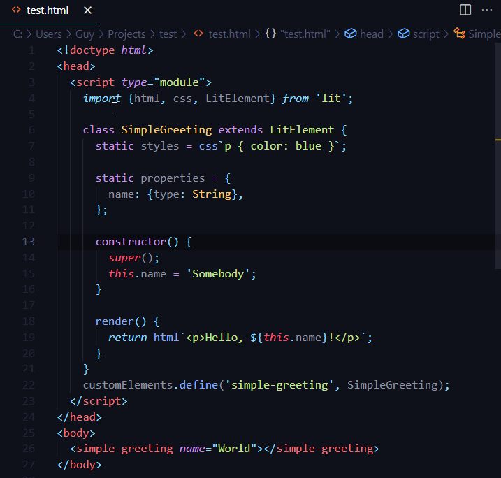

# JSPM VSCode

Automatically generates and injects JSPM HTML import maps for modules and HTML pages.

Convenience tool for using the [JSPM Generator API](https://github.com/jspm/generator), like the [online generator sandbox](https://generator.jspm.io).

Adds a `"JSPM: Generate Import Map"` command to VSCode with environment customization options as well as the ability to configure preload and integrity injections.

Example:

# License

MIT